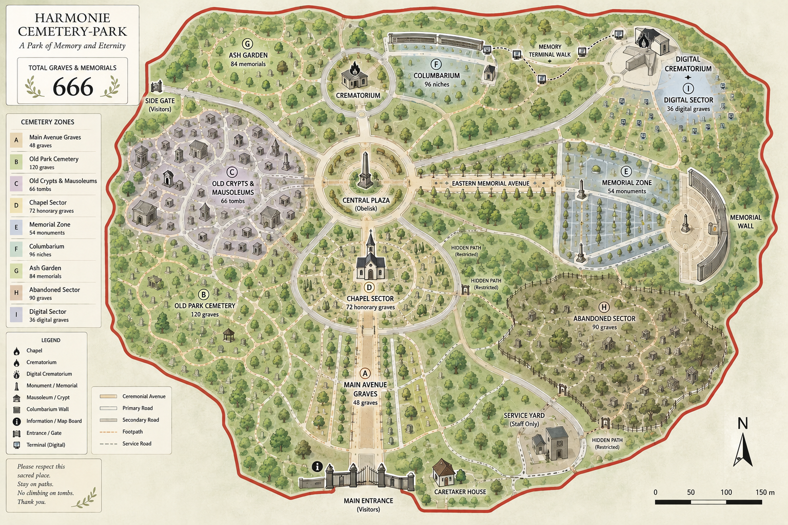

<div align="center">

# VibeCemetery

**Dead projects should not disappear silently.**

A pixel cemetery for abandoned GitHub repos and local projects.<br>
No users. No runway. One very patient gravedigger.

[Enter the cemetery](https://vibecemetery.app/cemetery) · [Bury a project](https://vibecemetery.app) · [Agent instructions](https://vibecemetery.app/agent-instructions) · [Docs](docs/README.md)

</div>

## Every unfinished idea deserves an ending

Half-built SaaS. A trading bot with one terrible trade. An MVP that never met a user. The folder called `final-final-v3`.

You spent time, tokens and a little hope on it. Give it a grave, an epitaph and a link people can visit. Keep the code. Let the project rest.

> Scan your GitHub. Pick a cause of death. Begin the ritual. Close the tab. It is done.

## The ritual

- **Bury it.** Connect GitHub and pick an eligible abandoned repo. For local projects, give your coding agent the [burial instructions](https://vibecemetery.app/agent-instructions).
- **Visit it.** Walk the cemetery, read epitaphs and press **F** to pay respects.
- **Remember it.** Share a grave. Find projects in **The Crypt** and their gravediggers in **Necropolis**.

GitHub repos must belong to you, contain a project, not be forks and have no pushes for at least seven days. Each account starts with four graves; sharing your first grave unlocks one more. GitHub and local projects use the same allowance. Burial never deletes your source code.

## $GRAVE tributes

**Burn $GRAVE in memory of someone else's buried project.**

Open their grave, connect a wallet on Base and choose an amount. The tokens go to the burn address; the tribute is attached to that project's memorial after verification. **The Crematory** keeps the ledger.

A permanent gesture for a project that almost made it.

## A cemetery that grows

**Two of nine zones are open**, with 144 grave plots available in the current map. The full world is planned for **666 graves**.

New zones will open at checkpoints tied to the amount of **$GRAVE burned**. Burn thresholds and zone releases will be announced as the world expands.



*The master plan shows the full world concept. Its illustrated zone allocations are provisional; the playable map currently has 144 plots across two open zones.*

<details>
<summary><strong>A note from the Keeper</strong></summary>

VibeCemetery is a solo indie project built with Claude Code, OpenCode and GPT.

After discovering AI coding, I spent two months making more than 50 projects: scripts, mini-games, experiments and half-alive ideas. Then the rush faded. I looked back and found a graveyard with no users and no future.

So I gave it a place.

Somewhere in this cemetery, an empty grave is already waiting for VibeCemetery itself. One day, the gravedigger will return with his shovel.

Even the cemetery must be buried.

</details>

<details>
<summary><strong>Build with us</strong></summary>

Next.js 16 · React 19 · Phaser 3 · Supabase Postgres · Base · Vercel

```bash
git clone https://github.com/azkian1/VibeCemetery.git
cd VibeCemetery
npm ci
cp .env.example .env.local
npm run dev
```

Configure your own development database and GitHub OAuth app using the [setup guide](docs/setup.md). Start with [Contributing](CONTRIBUTING.md) and the [map reference](docs/map2.md).

The v2 map, tiles and runtime images are committed here and served by the application CDN. Map loading does not use Supabase Storage.

[Security](SECURITY.md) · [MIT code license](LICENSE)

</details>

---

<div align="center">

Built by [@azaticus](https://x.com/azaticus)

*"He buried others until it was his turn."*

</div>
